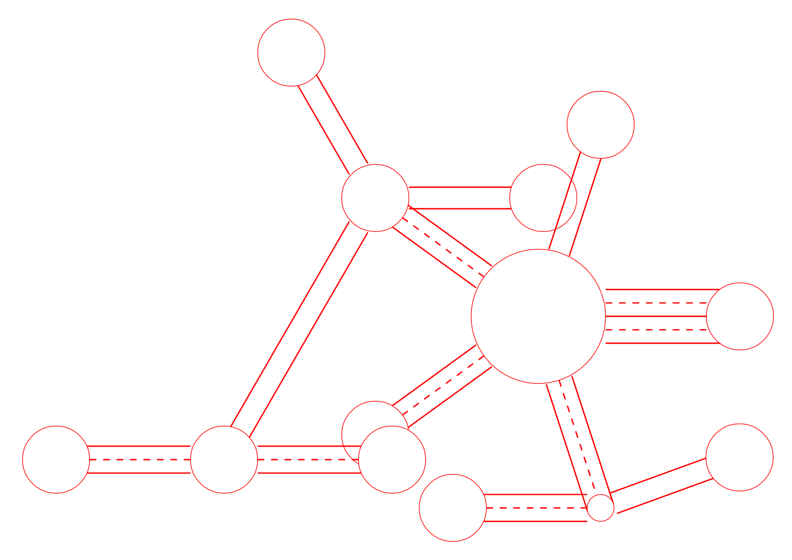

# roadnet

## Description

Ruby based compiler for converting an XML description of a road network into an HTML/CSS visual representation. Completed as part of McMaster University course on Syntax Tools & Compilers.

## Installing

Ensure that you have a recent version of ruby installed.
- `gem install bundler`
- `cd` into this directory
- `bundle install`

## Running

- `ruby parser.rb -f rd.xml`

- options: `-f` specifies input `.xml` file, `-o` specifies output html file containg `.svg` graphic

## Features

- Nested hierarchies
- Road, street, and avenue types
- Specifiable attributes: • Intersection-radius
- Angle-offset
- Intersectino-offset
- Length of link

## How it Works

The script descends the XML file recursively, drawing svg objects as it parses. It uses Nokogiri to parse XML and create the final HTML file.

## Output

